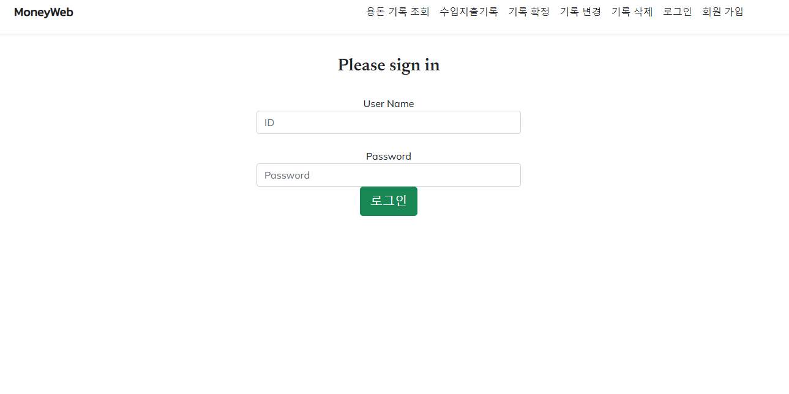
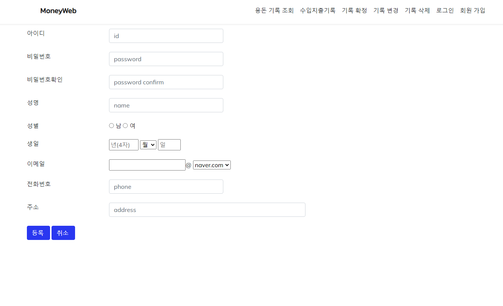

# PandaMun-JSP_pocketmoneyentry


JSP를 공부하면서 만들었었던 웹 용돈 기입장입니다.

복잡하지 않고 간단하게 만들었던 사이트입니다.



위의 페이지는 로그인 페이지이며 로그인을 하지 않을시 조회 변경 삭제가 되지 않도록 스크립트 함수에 세션아이디를 받아와 검증하는 간단한 로직으로 만들었습니다.



그밖에 회원가입 페이지 , 용돈 관리 삭제 변경 페이지등을 만들었습니다.

```java
<%@ page language="java" contentType="text/html; charset=UTF-8"
    pageEncoding="UTF-8"%>
<%@ page import ="java.sql.*" %>

<!DOCTYPE html>
<html>
<head>
<meta charset="UTF-8">
<title>Insert title here</title>
</head>
<body>
<%
Connection conn = null;		
String url = "jdbc:mysql://localhost:3306/moneyweb";
String user = "root";
String password = "12341234";
Class.forName("com.mysql.jdbc.Driver");
conn = DriverManager.getConnection(url, user, password);		
%>
</body>
</html>
```

dbconn.jsp 이라는 데이터베이스 연결 페이지로써 moneyweb db를 연결했습니다.
